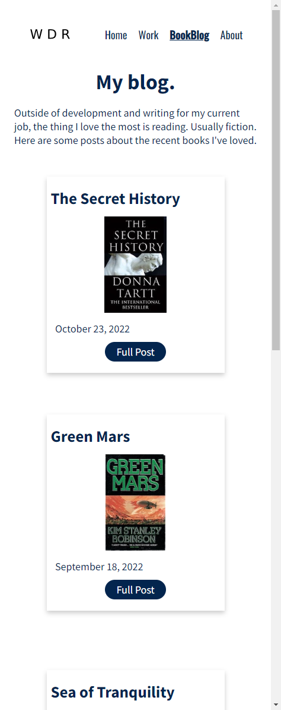

# T1A2: Portfolio Website

My portfolio website for CoderAcademy.

Deployed at [Netlify](https://jolly-muffin-00e5e8.netlify.app/index.html).

Source at [Github](https://github.com/willr42/coder-portfolio).

Site presentation video: TBC

## Purpose

To showcase my skills as a developer, to house my recent work, to add a little bit of personal character about myself to job applications.

## Features

Four-page static website featuring handbuilt HTML & CSS components.

## Target audience

Mainly future recruiters or coworkers. Also includes my programming peers, people in the OSS community.

## Tech stack

Static HTML and CSS website deployed on [Netlify](https://www.netlify.com/).

SCSS using Dart Sass. SCSS structure informed by this [best practices article](https://www.webdesignerdepot.com/2020/12/2-smartest-ways-to-structure-sass/).

Icons from [iconmonstr](https://iconmonstr.com/).

## Sitemap

## Screenshots

### Homepage

### Book Blog

### Blog Entry

### Work

### About

